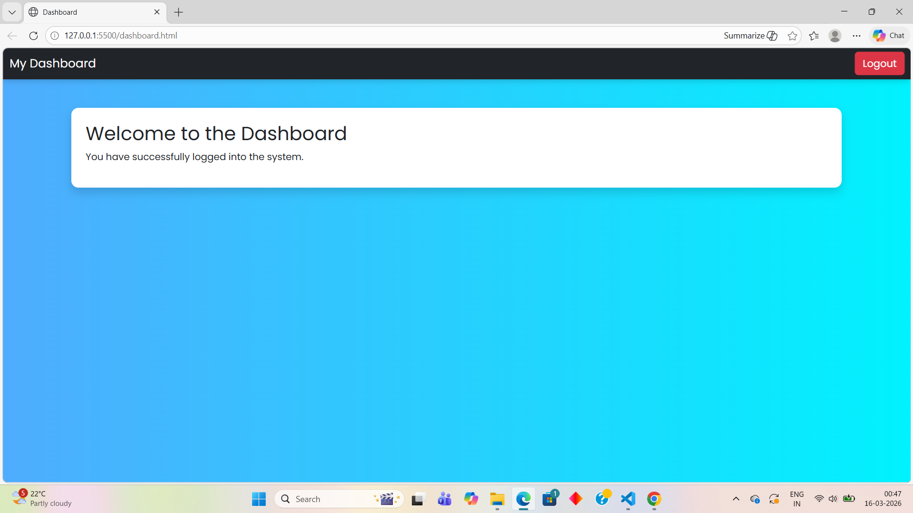

# Authentication System

This project is a styled authentication system using Bootstrap 5.

---

## Pages
1. Login
2. Register  
3. Forgot Password  
4. Reset Password  
5. Dashboard

---

## Screenshots

1. Login Page
[Login Page](login.png)

2. Register Page
[Register Page](register.png)

3. Forgot Password Page
[Forgot Page](forgot.png)

4. Reset Password Page
[Reset Page](reset.png)  

5. Dashboard Page

---

## Technologies Used
- HTML 
- CSS  
- Bootstrap 5  

---

## Features
- Modern gradient background and floating card design  
- Responsive layout for desktop, laptop, tablet, and mobile  
- Interactive buttons and hover effects  
- Styled links with hover color  
- Fully functional authentication pages  

github
git
